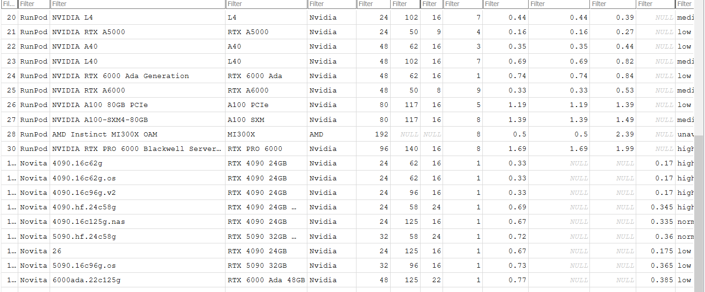

1. GPU Model - Done
7. Avaialibility - Done
6. hourly price - Done
2. VRam - Done
8. Current balance - Done
3. Ram (Incremental) - Done
4. Limit count how can we book - Done
5. 8vCpu or General nvCpu what is n here - Done

---

```
 & "C:\Program Files\Google\Chrome\Application\chrome.exe" `
   --remote-debugging-port=9222 `
   --user-data-dir="C:\Users\user\Documents\GPU_AGGREGATE\chrome_cdp_profile"
```

Current output
