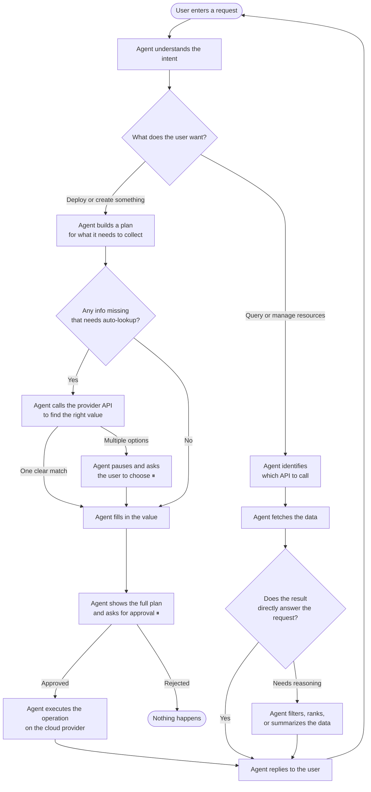

# GPU Aggregate

A multi-provider GPU orchestration platform with an autonomous AI agent CLI. Supports live GPU catalog syncing, datacenter management, and natural-language pod deployment across RunPod and Novita.

---

## Architecture Overview

```
User (CLI) → LangGraph Agent (showdown.py) → FastAPI Connector (:8001) → RunPod / Novita APIs
                                                                        → SQLite (gpu_catalog)
                                                                        → MongoDB (datacenters)
```

The agent uses a stateful LangGraph graph with human-in-the-loop interrupt points at:
- **selection_node** — when multiple candidates exist and user must pick one
- **create_user_clarifier** — when a required create param needs user input
- **confirmation_gate** — before any cost-incurring or destructive operation

See [`docs/ARCHITECTURE.md`](docs/ARCHITECTURE.md) for the full graph diagram and node breakdown.


```bash
                Scheduler
                    │
     ┌──────────────┴──────────────┐
     │                             │
 RunPod Sync                  Novita Sync
     │                             │
 GraphQL + UI                REST APIs
 Playwright                  CLI + REST
     │                             │
     └──────────────┬──────────────┘
                    │
          Normalization Layer
                    │
             SQLite GPU Catalog
                    │
         Mongo Datacenter Cache
                    │
              FastAPI Connector
                    │
             LangGraph Agent
                    │
               Natural Language
```




---

## Prerequisites

- Python 3.11+
- Google Chrome
- MongoDB running on `localhost:27017`
- RunPod account + API key
- Novita account + API key
- Groq API key (free at https://console.groq.com)

---

## Setup

### 1. Clone the project

```bash
git clone <repo-url>
cd GPU_AGGREGATE/backend
```

### 2. Create virtual environment

```powershell
python -m venv .venv
.venv\Scripts\activate
```

### 3. Install dependencies

```powershell
pip install -r requirements.txt
```

### 4. Configure environment

Create a `.env` file in the project root:

```env
RUNPOD_API_KEY=your_runpod_api_key
NOVITA_API_KEY=your_novita_api_key
GROQ_API_KEY=your_groq_api_key
FASTAPI_BASE_URL=http://localhost:8001
```

### 5. Start Chrome in remote debugging mode

```powershell
& "C:\Program Files\Google\Chrome\Application\chrome.exe" `
   --remote-debugging-port=9222 `
   --user-data-dir="C:\Users\user\Documents\GPU_AGGREGATE\chrome_cdp_profile"
```

### 6. Log in to RunPod and Novita

- Open `https://console.runpod.io/deploy` — log in and stay on this page
- Open `https://novita.ai/gpus-console/storage` — log in and stay on this page

The Playwright scrapers connect to these tabs via Chrome DevTools Protocol. **Do not close Chrome while the scheduler is running.**

---

## Running the System

All commands run from the `backend/` directory with the venv activated.

### Step 1 — Initialize the database

```powershell
python database/db.py
```

Creates `database/gpu_catalog.db`.

### Step 2 — Start the scheduler (GPU catalog sync)

```powershell
python scheduler.py
```

**Initial run:** scrapes RunPod deploy page + GraphQL, fetches Novita GPUs, syncs datacenters, stores everything into SQLite and MongoDB.

**Background jobs:**

| Job | Interval | What it updates |
|-----|----------|-----------------|
| RunPod full catalog | 1 hour | All GPU fields |
| Novita full catalog | 1 hour | All GPU fields |
| RunPod datacenters | 4 hours | Datacenter list |
| Novita datacenters | 4 hours | Datacenter list |
| RunPod live fields | 20 seconds | Price, availability, deployable |
| Novita live fields | 20 seconds | Price, availability, deployable |

### Step 3 — Start the connector API

```powershell
uvicorn connector:app --reload --port 8001
```

The connector exposes all GPU and pod operations as HTTP endpoints. The agent calls this internally.

Key endpoints:

| Endpoint | Description |
|----------|-------------|
| `GET /gpus/{provider}` | All GPUs for a provider |
| `GET /gpu_catalog` | API-ready gpu_ids (used by agent for create) |
| `GET /pod_context/{provider}` | GPUs + volumes + defaults in one call |
| `GET /{provider}/user_pods` | Your active pods |
| `GET /{provider}/datacenters` | Available datacenter IDs |
| `POST /{provider}/create_pod` | Deploy a new pod |
| `POST /{provider}/create_volume` | Create a network volume |
| `POST /{provider}/start_pod/{pod_id}` | Start a stopped pod |
| `POST /{provider}/stop_pod/{pod_id}` | Stop a running pod |
| `DELETE /{provider}/delete_pod/{pod_id}` | Delete a pod |
| `DELETE /{provider}/delete_volume/{volume_id}` | Delete a volume |

### Step 4 — Start the AI agent CLI

```powershell
python showdown.py
```

---

## Using the Agent

Type any natural language request at the `You:` prompt.

```
You: show me all gpus
You: show me cheapest H100
You: deploy RTX 4090 on runpod
You: show me my pods on novita
You: stop pod abc123 on runpod
You: create a 20gb volume called my-vol on runpod
You: exit
```

### Supported operations

| Intent | Example prompt |
|--------|----------------|
| List GPUs (all providers) | `show me all gpus` |
| List GPUs (one provider) | `show me runpod gpus` |
| Find cheapest GPU | `show me cheapest H100` |
| Deploy a pod | `deploy RTX 4090 on runpod` |
| List your pods | `show me my pods on novita` |
| Get pod details | `get details for pod abc123 on runpod` |
| Start a pod | `start pod abc123 on runpod` |
| Stop a pod | `stop pod abc123 on novita` |
| Delete a pod | `delete pod abc123 on runpod` |
| List your volumes | `show my volumes on runpod` |
| Create a volume | `create a 20gb volume called my-vol on runpod` |
| Delete a volume | `delete volume xyz on novita` |
| List providers | `what providers are available` |

### How GPU resolution works

You never need to type an exact GPU ID. The agent resolves it automatically:

```
You: deploy RTX 4090 on runpod
→ Agent queries /pod_context/runpod (live catalog)
→ LLM matches "RTX 4090" → "NVIDIA GeForce RTX 4090" (real API ID)
→ Agent shows full deployment params for confirmation
```

### Selection prompts

When the agent finds multiple candidates it cannot auto-narrow, it pauses and asks:

```
[Select] Multiple GPUs found — which do you mean?
  1. NVIDIA GeForce RTX 4090  —  $0.74/hr
  2. NVIDIA GeForce RTX 4090 (community)  —  $0.44/hr

Pick (number or exact value): 1
```

### Confirmation gate

Every create, start, stop, or delete operation shows the full payload before executing:

```
[Confirm] create_pod on runpod
  name:              my-pod
  gpu_id:            NVIDIA GeForce RTX 4090
  image_name:        runpod/pytorch:2.4.0-py3.11-cuda12.4.1-devel-ubuntu22.04
  gpu_count:         1
  container_disk_gb: 20
  volume_gb:         20

Approve? (yes/no): yes
```

Type `yes` to execute or `no` to cancel.

### Exit

Type `exit`, `quit`, or `q`.

---

## Project Structure

```
backend/
  showdown.py          # LangGraph AI agent CLI
  connector.py         # FastAPI HTTP bridge to provider APIs
  scheduler.py         # APScheduler for catalog and datacenter syncs
  scheduler_helper.py  # SQLite upsert helpers
  database/
    db.py              # SQLite schema and connection
    gpu_catalog.db     # GPU catalog (created at runtime)
  scrapers/
    runpod.py          # RunPod SDK (REST + GraphQL)
    runpod_playwright.py  # RunPod Playwright scraper
    novita.py          # Novita SDK (REST + CLI)
    novita_playwright.py  # Novita Playwright scraper
    common_db_hits.py  # Shared MongoDB queries
  constants/
    runpod_constants.py
  tempFrontend/
    dashboard.py       # Streamlit dashboard (prototype)
docs/
  ARCHITECTURE.md      # Full LangGraph graph diagram + node reference
  AGENT_DEEP_DIVE.md   # Design decisions, known issues, scaling notes
  BUSINESS_ROI.md      # Business value and ROI analysis
  TEACHING_SCRIPT.md   # 15-minute video script
```

---

## Current Providers

| Provider | Pods | Volumes | Catalog | Datacenters |
|----------|------|---------|---------|-------------|
| RunPod | ✅ | ✅ | ✅ | ✅ |
| Novita | ✅ | ✅ | ✅ | ✅ |

Adding a new provider requires implementing the `CompoundProvider` interface and adding one entry to the `providers` dict in `connector.py`.

---

## Known Limitations

- Session memory is not persisted across CLI runs (in-process `MemorySaver` only)
- Chrome must stay open for the Playwright scrapers to work
- No authentication on the connector API (localhost only)
- Novita pod creation uses the `novita` CLI tool (must be installed and authenticated separately)

See [`docs/AGENT_DEEP_DIVE.md`](docs/AGENT_DEEP_DIVE.md) for full details on current limitations and planned fixes.